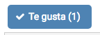
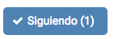
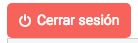

# Geopromos Web Core Elements 🔥 🔥

Geopromos core ui and elements, developed with `react@^16.0.0` 

<!-- TOC -->

- [Geopromos Web Core Elements 🔥 🔥](#geopromos-web-core-elements-🔥-🔥)
  - [ButtonLike](#buttonlike)
  - [ButtonFollow](#buttonfollow)
  - [ButtonLogOut](#buttonlogout)
  - [Collaborate](#collaborate)
  - [Dev Features](#dev-features)
  - [Folder structure](#folder-structure)
  - [Credits](#credits)
  - [License](#license)

<!-- /TOC -->

## ButtonLike
Handles everything for liking or disliking whatever on Geopromos



```jsx
<ButtonLike
  onLogin={() => {}}
  className="Promo"
  objectId="E5SyTySkx5"
  interactionKey="promoId"
/>
```
PropTypes: 
```js
ButtonLike.propTypes = {
  onLogin: PropTypes.func.isRequired,
  objectId: PropTypes.string.isRequired,
  interactionKey: PropTypes.string.isRequired,
  className: PropTypes.string.isRequired,
};
```

## ButtonFollow
Handles everything for following or unfollowing whatever on Geopromos



```jsx
<ButtonLike
  onLogin={() => {}}
  className="Promo"
  objectId="E5SyTySkx5"
  interactionKey="promoId"
/>
```
PropTypes: 
```js
ButtonFollow.propTypes = {
  onLogin: PropTypes.func.isRequired,
  objectId: PropTypes.string.isRequired,
  interactionKey: PropTypes.string.isRequired,
  className: PropTypes.string.isRequired,
};
```

## ButtonLogOut
Displays a button for logging out



```jsx
<ButtonLogout onClick={() => { this.logOut() }} />
```

PropTypes: 
```js
ButtonLogout.defaultProps = {
  onClick: undefined,
};

ButtonLogout.propTypes = {
  onClick: PropTypes.func,
};
```

## Collaborate
1. Clone this repository
1. Run `yarn install` (Usage of Yarn is recommended)
1. Edit the `src/index.jsx` file and then run `npm run dev`.  
1. This will start the `webpack-dev-server` 
1. Then open your browser at `localhost:3100`
1. The browser will be updated everytime you change the code at `src/index.jsx`

## Dev Features
* Linting with eslint
* Linting code style: Airbnb
* Testing with `jest@^21.2.1` and `enzyme@^3.1.1`
* Uses `babel` for JS transpiling
* Uses `webpack` for building the code

## Folder structure
* `/src`: The module code
* `/test`: The tests for the `src` components
* `/build`: The target compilation directory

## Credits
Juan Camilo Guarín Peñaranda  
[Otherwise SAS](https://github.com/owsas)  
Cali, Colombia, 2017

## License
All rights reserved.  
Otherwise SAS  
Colombia  
2017

